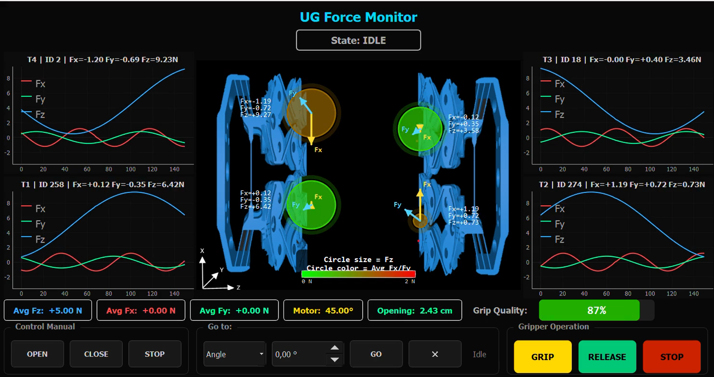

# Universal Gripper ROS 2

ROS 2 Jazzy interface and control software for the Universal Gripper (UG).

## Overview

This repository contains the ROS 2 software for controlling and monitoring the Universal Gripper.

The system integrates:

* Motor control through CAN
* XELA uSPa11 tactile sensors
* Gripper state machine
* ROS 2 interfaces
* Graphical user interface

## Graphical User Interface

The Universal Gripper is controlled and monitored through a PyQt5 graphical interface.



## Repository Structure

The repository is organized into three ROS 2 packages:

### `ug_interfaces`

Contains the custom ROS 2 interfaces used by the Universal Gripper.

* Messages
* Services
* Actions

### `ug_hardware`

Contains the hardware and control logic.

* CAN communication
* MKS SERVO42D motor control
* XELA uSPa11 tactile sensor driver
* Sensor calibration
* Gripper state machine
* ROS 2 hardware interface

### `ug_ui`

Contains the graphical user interface for monitoring and controlling the gripper.

* PyQt5 interface
* Gripper control
* Sensor visualization
* System status

## Requirements

* Ubuntu 24.04
* ROS 2 Jazzy
* Python 3
* CAN interface
* Universal Gripper hardware

## Installation

Clone the repository:

```bash
git clone https://github.com/snt-spacer/universal-gripper-ros2.git
cd universal-gripper-ros2
```

Source ROS 2 Jazzy:

```bash
source /opt/ros/jazzy/setup.bash
```

Install dependencies:

```bash
rosdep install --from-paths src --ignore-src -r -y
```

Build the workspace:

```bash
colcon build
```

Source the workspace:

```bash
source install/setup.bash
```

## Running the Universal Gripper

Launch the hardware interface and graphical user interface:

```bash
ros2 launch ug_hardware ug_hardware.launch.py
```

The launch sequence is:

```text
                    ros2 launch
                         │
                         ▼
              ┌─────────────────────┐
              │  Hardware Interface │
              └──────────┬──────────┘
                         │
          ┌──────────────┼──────────────┐
          ▼              ▼              ▼
       CAN Bus        Motor         Tactile
      Connection    Initialization    Sensors
                         │              │
                         │              ▼
                         │       Automatic Calibration
                         │              │
                         └──────┬───────┘
                                ▼
                    ┌─────────────────────┐
                    │   State Machine     │
                    └──────────┬──────────┘
                               │
                               ▼
                    ┌─────────────────────┐
                    │     Graphical UI    │
                    └─────────────────────┘
```

The hardware interface initializes the CAN communication, motor controller, and tactile sensors. The tactile sensors are automatically calibrated during startup. Once the hardware is initialized, the gripper state machine starts and the graphical interface connects to the ROS 2 system for monitoring and control.


The tactile sensors are calibrated automatically during hardware initialization.

## Configuration

Hardware and control parameters are defined in:

```text
src/ug_hardware/ug_hardware/config.py
```

The main parameters to check are:

| Parameter              | Description                          | Example             |
| ---------------------- | ------------------------------------ | ------------------- |
| `CAN_INTERFACE`        | CAN interface type                   | `slcan`             |
| `CAN_CHANNEL`          | CAN adapter device                   | `/dev/ttyACM0`      |
| `CAN_BITRATE`          | CAN bus bitrate                      | `1000000`           |
| `ANGLE_OPEN_DEG`       | Fully open position                  | `0.0`               |
| `ANGLE_CLOSED_DEG`     | Fully closed position                | `221.5`             |
| `TEXEL_IDS`            | XELA tactile sensor CAN IDs          | `[258, 274, 18, 2]` |
| `SENSOR_CALIB_SAMPLES` | Samples used for startup calibration | `100`               |
| `SM_LOOP_HZ`           | State machine update frequency       | `20.0`              |

The tactile sensors are calibrated automatically during hardware initialization.


## Hardware

The current system uses:

* MKS SERVO42D motor controller
* XELA uSPa11 tactile sensors
* CAN communication interface

The CAN adapter and Universal Gripper hardware must be connected before starting the system.

## ROS 2 Interfaces

The system provides ROS 2 topics, services, and actions for controlling the gripper and accessing its status and tactile sensor data.

Custom interfaces are defined in the `ug_interfaces` package.

## License

This project is licensed under the Apache License 2.0.
